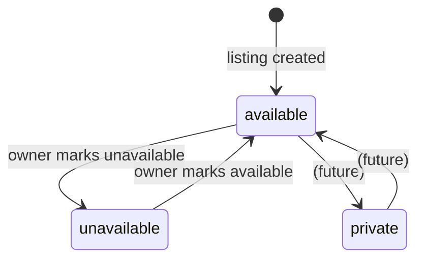

# Listing Statuses

Listings have a `status` field that controls visibility and availability.

## Status Values

| Status        | Public Detail Page | Appears in Search | Owner Can Toggle To |
| ------------- | ------------------ | ----------------- | ------------------- |
| `available`   | Shown normally     | Yes               | `unavailable`       |
| `unavailable` | Shown with notice  | No                | `available`         |
| `private`     | Not found (404)    | No                | (reserved)          |

## State Diagram



## UI Behavior

### My Garden (`/listings/mine`)

Each listing card shows a status badge and a toggle button:

- **Available listings**: green badge, "Mark Unavailable" button
- **Unavailable listings**: muted badge, "Mark Available" button

The toggle sends a `PATCH /api/listings/:id` request with `{ status }` and updates the badge optimistically on success.

### Listing Detail Page (`/listings/:id`)

- **Available**: shown normally with all public details
- **Unavailable**: shown with an "unavailable" notice encouraging the visitor to check back later
- **Private**: returns 404 (listing not found)

## API

### `PATCH /api/listings/:id`

Updates the listing status. Requires authentication. Only the listing owner can update.

**Request body** (validated by `updateListingStatusSchema`):

```json
{ "status": "available" | "unavailable" | "private" }
```

**Responses**:

- `200` — success
- `400` — invalid status value
- `401` — not authenticated
- `404` — listing not found or not owned by requester

## Design Decisions

- **`private` is reserved**: the toggle UI only offers `available` ↔ `unavailable`. The `private` status exists for future use (e.g., draft listings or admin-hidden).
- **No soft delete in this PR**: listings are hard-deleted. Soft delete via a `deletedAt` column is a future consideration.
- **Immediate UI update**: the status badge updates on the client after a successful API response, without a full page reload.
