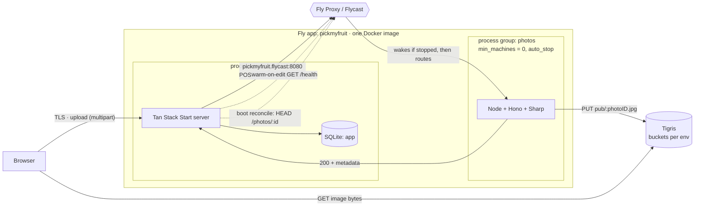
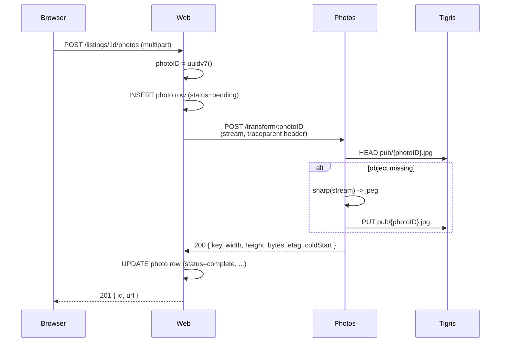
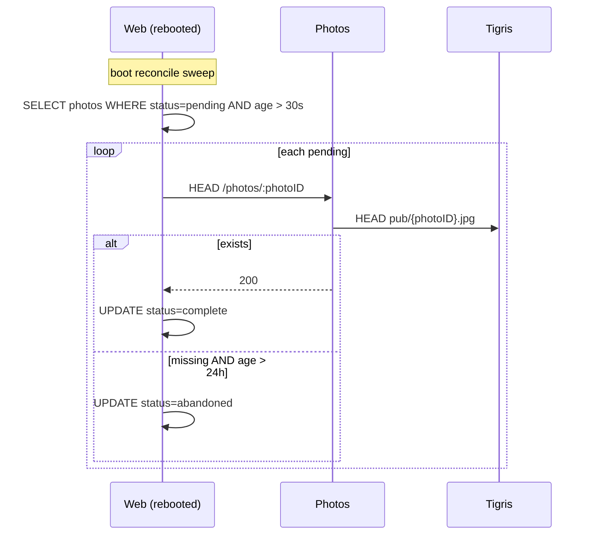

# 0006 — Image Upload Service

Status: **Decided — Proposal B (scale-to-zero photos app, Tigris everywhere).**
The detailed plan for B 1.0 is at the bottom of this document. The B 2.0
direction (named transforms, TOML-driven config, extractable
`tiny-photo-uploader` package) is sketched as future work. The earlier
conversations and the no-consensus framing are kept as background.

## Background

Recent commits stabilised photo uploads on the existing single-VM Fly
deployment by streaming bytes to a temp file, capping Sharp concurrency,
serialising libvips inside the process, and tuning Fly memory headroom. The
fundamental shape, however, is unchanged: the entire decode → resize → encode
→ upload pipeline runs inside a single Tan Stack Start request handler,
sharing RSS with every other route.

Two structural problems remain:

1. **Blast radius.** A bad upload can OOM the web process and take the whole
   site down. Memory limits are tuned but not isolated.
2. **Idle cost.** libvips and Sharp sit in the web container's RSS 24/7,
   even though uploads are sporadic (minutes-to-hours apart at MVP scale).

We want the smallest design that fixes both without exceeding our budget or
our solo-founder maintenance capacity.

## Conversation 1 (Cursor) — Same-VM background worker

The first design treated the goal as **process isolation on a single Fly
machine**.

Key decisions reached:

- Extract the photo pipeline into a workspace package with explicit
  inputs/outputs and clear test boundaries.
- Two Fly **process groups** in one app: `web` and `photo-worker`. Sharp is
  imported only by `photo-worker`. Concurrency = 1 in a single long-lived
  worker loop — no per-upload subprocess.
- Web returns **HTTP 202** quickly after staging bytes, and the client polls
  by `listingId` (refresh-safe; never depends on a `jobId` the browser
  remembers).
- **All app blobs live in Tigris.** A dedicated staging bucket gets a
  bucket-wide lifecycle rule (days since last modified, since Tigris does
  not support per-object expiry); finals live in a separate bucket with no
  aggressive retention. The happy path still issues `DELETE` on staging
  after success; the lifecycle is a safety net.
- **Job state in SQLite** in a dedicated `jobs.sqlite` (separate from the
  app DB), owned by the worker. Web speaks **HTTP/TCP (loopback) to the
  worker** for enqueue and status reads — chosen over UDS so the same
  protocol works in dev, CI, prod, and after extraction. Trade-off: if the
  worker is down, enqueue fails (acceptable; rare).
- Job rows keyed on UUIDv7 photo IDs assigned at first touch; deterministic
  staging/raw/pub keys derived from the same ID.
- Latency goals: P50 10 s, P95 30 s, P99 60 s. Lease TTL 3–5 min; orphan
  queued ≥ 10–15 min → expired.
- Testing: **Hurl + LocalStack/S3Mock** as the language-agnostic regression
  spine; Vitest for pure logic; a tiny non-Hurl tier for image semantics
  (EXIF/orientation/dimensions).

Discarded along the way: managed workflow engines (Temporal et al.), Redis,
SSE, single "god" storage interface with a phase flag, gRPC, browser →
presigned PUT, OS subprocess per upload, shell-supervised child, rewriting
the worker in Rust/Go now.

### Why this design is incomplete

The worker still **lives in the same container as web**, so libvips remains
in the machine's RSS even when nothing is uploading. Process-group
separation isolates *crashes* and *peak memory during a job*, but not the
**~80–150 MB idle baseline** of having Sharp loaded somewhere on the box.

## Conversation 2 (Claude) — Scale-to-zero separate Fly app

The second conversation accepted the first as correct for blast radius but
challenged the idle-cost story. It proposes:

- **A second Fly app**, `pickmyfruit-photos`, with
  `min_machines_running = 0`, `auto_stop_machines = "stop"`,
  `auto_start_machines = true`. Fly's proxy wakes it on the first inbound
  request (~1–2 s cold start).
- The web app talks to it over Fly's private 6PN network
  (`pickmyfruit-photos.internal:8080`) as if it were always up. No Machines
  API code, no queue, no jobs DB.
- **Synchronous transform endpoint.** Web generates a `photoID` (UUIDv7)
  *before* calling photos, persists a `pending` row, then `POST`s the bytes
  with the ID in the path. Photos transforms, writes to a deterministic
  Tigris key (`pub/{photoID}.jpg`), returns metadata. Web flips the row to
  `complete`.
- **S3 is the source of truth.** Photos owns no SQLite. Re-issuing the same
  `photoID` is idempotent: photos `HEAD`s the key first and short-circuits
  if the object exists.
- **Boot reconciliation** on web: scan `pending` rows older than N seconds,
  `HEAD` photos, flip to `complete` or `abandoned`. Solves "web rebooted
  during deploy while photos finished the work".
- **Optional warm-on-edit ping**: when a user lands on an editable listing,
  fire a best-effort `GET /health` so the cold start happens before the user
  picks a file.
- A "photos owns the whole photos API" variant was considered and rejected
  because it puts cold-start latency on the **read path** of listing views —
  the most common user action.

### Why this design is also incomplete

It assumes **all blobs live in Tigris**. We currently support a `local`
storage adapter (filesystem under a Fly durable volume) as well as the
`tigris` adapter. Web and photos cannot share a Fly durable volume — Fly
volumes are pinned to one machine — so making photos a separate app
**forces a storage decision** that conversation 2 did not address.

## The unresolved tension

Conversation 1 keeps everything on one VM, so the durable-disk adapter
keeps working. Conversation 2 fixes idle RSS but breaks durable-disk, since
the worker that writes blobs lives on a different machine than the web
process that would read them.

Two coherent ways forward:

### Proposal A — Keep durable-disk; add a read API to photos

- Photos owns the durable volume and exposes `GET /photos/:id` (or signed
  redirects) in addition to the transform endpoint.
- Web links/proxies image URLs through photos.
- **Cost:** photos is now on the **read path** for listing views. Cold
  starts (~1–2 s) hit users browsing listings, not just uploaders. Some of
  this is mitigated by HTTP caching headers + a CDN, but at MVP scale cache
  hit rates on a small catalogue are poor.
- **Benefit:** preserves the local/durable-disk option for self-hosters or
  cheap deployments where Tigris isn't desired.

### Proposal B — Drop durable disk; Tigris everywhere except in-process tests

- **Test:** in-memory or `tmpfile`-backed adapter (no network, no fixtures
  to clean up).
- **Dev:** Tigris with a different bucket *or* a `dev/` prefix in the shared
  bucket.
- **Staging:** Tigris with a different bucket *or* a `staging/` prefix.
- **Prod:** Tigris finals bucket + Tigris staging bucket (with lifecycle
  rule).
- Photos stays purely a transform service. Reads go straight from the
  browser to Tigris's public URL. **Photos is never on the read path.**
- **Cost:** dev/staging/CI now require Tigris credentials (or a local
  S3-compatible mock for unit/integration tests). Slightly higher friction
  for new contributors.
- **Benefit:** the architecture from conversation 2 works as drawn. Web
  rebuilds are stateless. Photos can scale to zero with no caveats. One
  storage story, one failure mode, one set of lifecycle rules.

A hybrid (keep `LocalStorageAdapter` for unit tests only, Tigris everywhere
else) is essentially Proposal B with a polite name.

## Open questions before picking

1. Do we still want `STORAGE_PROVIDER=local` to be a supported deployment
   target, or only a test/dev convenience? If only the latter, Proposal B
   wins almost by definition.
2. Is the Tigris cost for a dev/staging bucket acceptable? (Storage is
   trivial; egress is the watch-out.)
3. Are listing-page cold starts a real risk, or does Fly's wake-on-request
   + a CDN make Proposal A viable? Need a measured answer, not an
   intuition.
4. How do we want to handle EXIF/orientation/dimensions assertions in CI if
   we drop the local filesystem path? (Probably: keep `MemoryStorageAdapter`
   for Vitest; use LocalStack for the Hurl integration tier.)
5. Do we keep the SQLite jobs DB at all under Proposal B? Conversation 2
   argues no (S3 is truth, web holds the `pending` row). That removes a
   whole subsystem from conversation 1's plan.

## Decision

**Proposal B is accepted, implemented as a single Fly app with two process
groups behind Flycast.** The durable-volume option is removed. All app
blobs live in Tigris (different buckets per environment, an in-memory
adapter for tests). One `pickmyfruit` Fly app builds one Docker image and
runs it under two entrypoints (`web` and `photos`) as separate process
groups. Public traffic reaches `web` only; `web` reaches `photos` over
**Flycast** so Fly Proxy can auto-start the photos machine on demand.
S3 is the source of truth; web holds `pending` rows and reconciles on
boot.

### Why one app, not two

A single app keeps one Docker image, one CI pipeline, one Node version,
one set of secrets, and one `fly deploy`. The reason this isn't free is
that Fly's `auto_stop_machines` / `auto_start_machines` lives in **Fly
Proxy**, and 6PN private DNS (`<process>.process.<app>.internal`) bypasses
the proxy via WireGuard. A 6PN request to a stopped Machine simply fails;
nothing wakes it.

**Flycast** puts Fly Proxy in front of a private service on the same app,
so internal callers get auto-start without exposing the service publicly.
The cost is one Fly concept to learn and one extra hostname
(`<app>.flycast`) instead of `<process>.process.<app>.internal`.

See [Private applications and Flycast](https://fly.io/docs/blueprints/private-applications-flycast/)
and [Autostart/autostop private apps](https://fly.io/docs/blueprints/autostart-internal-apps/).

The rest of this document is the implementation plan and as-built notes.

---

# Future direction: B 2.0

These are not in scope for the first cut, but the 1.0 design should not
make them harder.

### Named transforms

The service should eventually support multiple named outputs per upload —
e.g. `thumbnail`, `medium`, `large` — written as deterministic keys like
`pub/{photoID}/{transform}.jpg`. Two ways to share that key layout between
web and photos:

1. **Photos returns the paths.** The transform response includes a map
   `{ thumbnail: "pub/.../thumbnail.jpg", medium: "..." }` and web stores
   them. Web stays ignorant of the layout.
2. **Shared package computes paths.** A small package (e.g.
   `@pmf/photo-keys`) exports `keyFor(photoID, transform)` and is depended
   on by both. No round-trip needed; web can render a thumbnail URL the
   moment it has a photo ID.

**1.0 will hard-code a single transform and return its key.** That keeps
the contract thin and defers the choice between (1) and (2) until we
actually have multiple transforms.

### TOML-driven configuration

Configure transforms (name, dimensions, format, quality) and storage
(bucket per environment, prefix, public URL template) in a TOML file
loaded at boot. This is the move toward a reusable
`tiny-photo-uploader` package that another project could drop in.

1.0 will use env vars for the same knobs. The config schema can be
re-shaped into TOML once the surface stabilises.

---

# B 1.0 — Implementation plan

## Goals

- Photos process group scales to zero; web's idle RSS carries no Sharp.
- Web never imports Sharp.
- One transform endpoint, synchronous, idempotent on `photoID`.
- Tigris is the only storage; an in-memory adapter exists for Vitest.
- Tests bind to the **HTTP contract**, not the implementation language.
- Distributed traces span web → photos; cold-start is observable.
- One Docker image, one `fly deploy`, two entrypoints.

## Box architecture



Notes:
- Web → Photos goes through **Flycast** (`pickmyfruit.flycast:8080`), not
  raw 6PN, so Fly Proxy can auto-start a stopped photos machine. The
  `.flycast` hostname is reachable only from inside the org's private
  network; it is not publicly routable.
- Public ingress is bound to the `web` process group via `processes =
  ["web"]` on the public `[http_service]`. The photos process group has a
  separate `[[services]]` block scoped to Flycast.
- Browser reads images **directly from Tigris**, never through photos. The
  photo service is on the upload/reconcile path only.

## Data flow (happy path)



Crash variants:



## Components

### Repository layout

One Fly app, one Docker image, two entrypoints:

```
apps/
  www/                  # existing Tan Stack Start app — entrypoint for `web`
  photos/               # new Hono service — entrypoint for `photos`
Dockerfile              # one image, builds both, sized for libvips
fly.toml                # one app, two process groups, two services
```

The Dockerfile installs deps for both apps in one stage (so `sharp` and
`libvips` ship in the image once). The two process groups select their
entrypoints via the `[processes]` table — e.g.
`web = "node apps/www/.output/server/index.mjs"` and
`photos = "node apps/photos/dist/index.mjs"`. Web's entrypoint never
imports `sharp`, so libvips stays on disk but out of web's RSS.

### Photo service (`apps/photos`)

- **Runtime:** Node 24, Hono on top of bare Node `http` (Hono buys us
  router + middleware ergonomics without weight; we can drop to bare
  `http` if it ever feels like overhead).
- **Endpoints:**
  - `POST /transform/:photoID` — stream in, `HEAD` Tigris,
    short-circuit-or-transform, `PUT` Tigris, return JSON metadata.
  - `HEAD /photos/:photoID` — Tigris `HEAD` proxy for reconciliation.
  - `GET /health` — also used as the warm-on-edit ping.
- **No SQLite.** No queue. State lives in Tigris and in web's DB.
- **Sharp config:** `sharp.concurrency(1)`, `sharp.cache(false)`,
  `sequentialRead: true`, fully streamed.
- **Auth:** static shared secret in a header (`x-internal-token`) sourced
  from Fly secrets. Flycast is private to the org, but defence-in-depth
  against a future misconfig is cheap.
- **Cold-start signal:** the process records `process_started_at` at boot
  and sets `firstRequest = true` until the first request finishes; the
  response includes `coldStart: boolean` and `bootMs: number` for that
  first request. Subsequent requests get `coldStart: false`.

### `fly.toml` shape (illustrative)

```toml
app = "pickmyfruit"
primary_region = "sjc"

[build]
  dockerfile = "Dockerfile"

[processes]
  web    = "node apps/www/.output/server/index.mjs"
  photos = "node apps/photos/dist/index.mjs"

# Public ingress — web only.
[http_service]
  internal_port      = 3000
  force_https        = true
  auto_stop_machines = false
  min_machines_running = 1
  processes          = ["web"]

# Flycast — photos only, private to the org, auto-start on demand.
[[services]]
  internal_port        = 8080
  protocol             = "tcp"
  processes            = ["photos"]
  auto_stop_machines   = "stop"
  auto_start_machines  = true
  min_machines_running = 0

  [[services.ports]]
    port     = 8080
    handlers = ["http"]

[[vm]]
  processes = ["web"]
  size      = "shared-cpu-1x"
  memory    = "512mb"

[[vm]]
  processes = ["photos"]
  size      = "shared-cpu-1x"
  memory    = "256mb"
```

The Flycast hostname is `pickmyfruit.flycast` (org-private; not publicly
routable). Web reaches photos at `http://pickmyfruit.flycast:8080`.
Confirm the exact `[[services]]` shape against the [Flycast blueprint](https://fly.io/docs/blueprints/private-applications-flycast/)
before merging — Fly's config surface drifts faster than ADRs do.

### Web changes (`apps/www`)

- New `photoServiceClient.server.ts`: thin `fetch` wrapper around
  `PHOTOS_BASE_URL` (defaults to `http://pickmyfruit.flycast:8080` in
  prod), with auth header, trace propagation, and timeouts.
- `LocalStorageAdapter` is removed. A new `MemoryStorageAdapter`
  implements the same `StorageAdapter` interface for Vitest. The
  `STORAGE_PROVIDER` enum becomes `tigris | memory` (memory is
  test-only; production env schema rejects it).
- Photo upload route: assigns `photoID`, inserts `pending` row, calls
  photos, updates row on success, returns to client.
- Boot reconciliation runs once at startup and on a 1-hour interval.
- Optional warm-on-edit ping in the listing-edit route loader (fire and
  forget, 500 ms timeout).

### Tigris layout

- One bucket per environment: `pmf-photos-dev`, `pmf-photos-staging`,
  `pmf-photos-prod`. (Buckets, not prefixes — keeps lifecycle rules and
  IAM simple.)
- Single key layout: `pub/{photoID}.jpg`. (Named transforms = B 2.0.)
- No staging bucket in 1.0. With synchronous + idempotent, orphans only
  happen when web crashes between the photos `200` and the row update;
  a weekly sweep job (later) reconciles.

### Environments

| Env       | `STORAGE_PROVIDER` | Bucket / target          |
|-----------|--------------------|--------------------------|
| test      | `memory`           | in-process Map           |
| dev       | `tigris`           | `pmf-photos-dev`         |
| staging   | `tigris`           | `pmf-photos-staging`     |
| prod      | `tigris`           | `pmf-photos-prod`        |

The Hurl integration suite runs against a **LocalStack** S3 endpoint to
keep CI hermetic; the same Tigris adapter code path is exercised.

## Observability

- **Tracing:** OpenTelemetry. Web is already wired to Sentry; the photo
  service initialises an SDK that exports to the same Sentry project.
  Web propagates `traceparent` (W3C) on every call to photos. Photos
  attaches `photo.id`, `transform.name` (always `default` in 1.0),
  `bytes_in`, `bytes_out`, `width`, `height`, `mime_in`, `mime_out`,
  `coldStart`, `bootMs`, `sharpMs`, `tigrisHeadMs`, `tigrisPutMs` to
  the request span.
- **Cold-start visibility:**
  - In the response JSON: `coldStart`, `bootMs`.
  - On the span: `service.cold_start = true|false`, `service.boot_ms`.
  - Web logs a structured event when `coldStart = true` so dashboards
    can count cold starts vs total uploads without sampling loss.
- **Errors:** photos uses `Sentry.captureException` like web; no parallel
  console logging (see CLAUDE.md).
- **Health/metrics:** `/health` returns `{ ok, uptimeMs, sharpVersion }`
  for liveness + sanity at deploy time.

## Testing strategy

The contract under test is **the HTTP boundary**, so the suite survives a
language change in the photo service.

### Tier 1 — Hurl integration (primary regression suite)

- Lives in `apps/photos/tests/hurl/`.
- Runs photos under Node, points it at LocalStack as Tigris.
- Covers:
  - happy path single upload (assert 200, key in body, object exists in
    LocalStack via a follow-up Hurl `HEAD`).
  - idempotency: same `photoID` twice → second response includes
    `cached: true`, no re-upload.
  - bad MIME, bad bytes, oversized payload → typed error responses.
  - `HEAD /photos/:id` for present and absent objects.
  - auth: missing/wrong `x-internal-token` → 401.
  - cold-start metadata: first request after process start has
    `coldStart: true`, second has `coldStart: false`.
- Same `.hurl` files run in CI and locally via a single
  `apps/photos/bin/test-hurl` script that brings up LocalStack +
  photos, waits for `/health`, runs Hurl, tears down.

### Tier 2 — Vitest unit + acceptance (internal)

- `apps/photos/src/**/*.test.ts` for pure helpers (key derivation, MIME
  sniffing, error mapping, cold-start tracker).
- `apps/photos/tests/acceptance/*.test.ts` boots the Hono app in-process
  with the `MemoryStorageAdapter`, drives it via `app.fetch(req)` — fast,
  no network, no LocalStack. Same assertions as the Hurl tier minus the
  cross-process bits.
- `apps/www/tests/photoServiceClient.test.ts`: stub the photos endpoint
  with `msw` (or fetch mock) and verify retry, timeout, trace header
  propagation, error mapping.
- `apps/www/tests/reconcile.test.ts`: in-memory DB + stubbed photos
  client; verifies pending → complete and pending → abandoned
  transitions on the right age thresholds.

### Tier 3 — Image semantics (small, focused)

- Vitest with real Sharp + a handful of fixture JPEGs in
  `apps/photos/tests/fixtures/` covering EXIF orientation 1/3/6/8, an
  HEIC-named-as-JPEG, and a deliberately huge dimension. Asserts pixel
  dimensions and EXIF stripping on outputs. These run against the real
  pipeline and the `MemoryStorageAdapter`.

### Tier 4 — Smoke against staging

- A single Hurl file pointed at the staging Fly app, invoked from CI
  on `main` deploys after staging finishes. Uses a dedicated
  `pmf-photos-staging` bucket and a test photo ID with a known prefix
  for cleanup.

## Planned commits

Each commit should leave the tree green (`bin/code-quality.sh` + the
relevant new tests). Order is chosen so the photo service is verifiable
in isolation before web is wired to it.

1. **scaffold(photos): apps/photos hono skeleton + health check**
   - `apps/photos/{package.json,tsconfig.json,src/index.ts}`, Hono app
     with `/health`, Dockerfile, `fly.toml` template (not deployed
     yet), Vitest config.
   - Tests: Vitest acceptance test that hits `/health` via
     `app.fetch`. CI builds the Docker image.

2. **feat(photos): StorageAdapter interface + Tigris + Memory adapters**
   - Lift the adapter contract from `apps/www/src/lib/storage.server.ts`
     into a shared types-only module (or just re-implement the slice we
     need: `head`, `put` streaming, `delete`). Add `MemoryStorageAdapter`.
   - Tests: Vitest covering both adapters (Memory directly, Tigris via
     LocalStack in a CI-only test).

3. **feat(photos): POST /transform/:photoID with idempotent HEAD**
   - Stream-in body → Sharp → stream to adapter. Honour `sequentialRead`,
     concurrency = 1. Validate `photoID` is UUIDv7 with Zod.
   - Tests: Vitest acceptance (Memory adapter) for happy path,
     idempotency, validation errors, MIME rejection. Image-semantics
     fixtures land here.

4. **feat(photos): HEAD /photos/:photoID + auth middleware**
   - `x-internal-token` middleware sourced from env. `HEAD` proxies to
     adapter `head`.
   - Tests: Vitest acceptance for present/absent/unauthorised.

5. **feat(photos): cold-start tracker in response + span attributes**
   - `coldStart`, `bootMs` in response JSON; mirrored on the request
     span. `firstRequest` flips false in a `finally`.
   - Tests: Vitest acceptance — first call true, subsequent false. Use
     a fake clock for `bootMs`.

6. **feat(photos): OTel + Sentry wiring with traceparent ingestion**
   - SDK init, capture exceptions to Sentry, import context from
     incoming `traceparent`. Photo-id/byte-size/timing attrs on spans.
   - Tests: Vitest with an in-memory span exporter; assert parent-child
     relationship when a `traceparent` header is set.

7. **test(photos): Hurl integration suite + LocalStack harness**
   - `bin/test-hurl` script, GitHub Actions job, Hurl files for happy
     path, idempotency, auth, HEAD, cold-start metadata, error cases.
   - Tests: Hurl is the test. CI gates on it.

8. **feat(www): MemoryStorageAdapter + retire LocalStorageAdapter**
   - New `STORAGE_PROVIDER=memory` test path; remove `local`. Update
     env schema; production rejects `memory`.
   - Tests: replace existing `local`-based tests with `memory`. No
     production code path changes user-visibly.

9. **feat(www): photoServiceClient + replace inline Sharp pipeline**
   - Web no longer imports Sharp. Upload route assigns UUIDv7, inserts
     `pending` row, streams to photos, updates row on success.
   - Tests: `photoServiceClient.test.ts` (mocked photos), updated
     `tests/listing-photo-upload.server.test.ts` (msw-stubbed photos).

10. **feat(www): boot reconciliation + interval sweep**
    - On startup and hourly, scan `pending` photos older than 30 s,
      `HEAD` photos, transition state.
    - Tests: `tests/reconcile.test.ts` covering complete / still-pending
      / abandoned transitions and the age threshold.

11. **chore(www): drop sharp + libvips deps**
    - Remove `sharp` from `apps/www/package.json`, prune any now-dead
      streaming/EXIF helpers.
    - Tests: `pnpm typecheck` + existing suite. Verify Docker image RSS
      drops in a manual `fly deploy --build-only` measurement noted in
      the commit message.

12. **feat(infra): photos process group + Flycast service**
    - Update root `fly.toml` to add the `photos` process under
      `[processes]`, a Flycast `[[services]]` block scoped to it
      (`auto_stop_machines = "stop"`, `auto_start_machines = true`,
      `min_machines_running = 0`), and a per-process `[[vm]]` sized at
      256 MB. Update Dockerfile so both apps build into the one image.
      Add Tigris bucket + `INTERNAL_TOKEN` to Fly secrets. Web's
      `PHOTOS_BASE_URL` defaults to `http://pickmyfruit.flycast:8080`.
    - Tests: deploy to staging, scale `photos=1` once to verify boot,
      scale `photos=0` and confirm Fly Proxy auto-starts on the first
      web → photos request, then run the Tier 4 smoke Hurl file.

13. **feat(www): warm-on-edit ping in listing edit loader**
    - Best-effort `GET /health` with 500 ms timeout when an editable
      listing route loads.
    - Tests: Vitest unit on the loader; manual check that subsequent
      uploads measurably skip cold start (assert via the `coldStart`
      flag captured in upload telemetry).

14. **docs(adr): finalise 0006 with deployed reality**
    - Replace the "decision" section with as-built notes, link the
      Sentry dashboard for cold-start counts, link the Hurl suite.
    - Tests: none.

## Risks and watch-outs

- **Cold-start UX during upload.** Mitigated by the warm-on-edit ping;
  measured via the `coldStart` flag.
- **Flycast misconfig.** If the `[[services]]` block isn't scoped to
  `processes = ["photos"]`, Fly may try to route public traffic to
  photos, or photos may not be reachable on Flycast at all. Verify with
  `fly proxy 8080 -a pickmyfruit` from a dev machine after deploy and
  hit `/health` over Flycast in the staging smoke test.
- **Auto-start latency budget.** Flycast wake is ~1–2 s, same ballpark
  as a separate-app cold start. The warm-on-edit ping mitigates user-
  facing latency. If wake times grow unexpectedly (image size, region),
  switch `auto_stop_machines` from `"stop"` to `"suspend"`.
- **Process-group VM sizing drift.** `[[vm]]` blocks scoped to
  `processes` must be kept in sync as both groups evolve; an unscoped
  `[[vm]]` would apply to both. Lint check or comment guard in
  `fly.toml`.
- **Reconciliation correctness.** The 30 s "stuck pending" threshold
  must exceed P99 transform wall time. Start at 60 s and tune from
  observed data.
- **Tigris credentials in dev.** New contributors need a dev key.
  Document in `apps/photos/README.md` and provide a `.env.development`
  pointing at a shared dev bucket scoped to read/write only that
  prefix.
- **Browser caches a stale 404.** If the browser fetches the public URL
  before the `PUT` lands, it may cache the 404. Web should only render
  the `` after the upload returns 200; we never speculatively
  point the browser at the URL before then.

---

## As built (B 1.0)

All 14 planned commits were delivered on branch
`claude/image-upload-service-tdd-BUKMv`. Notable deviations from the
plan:

### Dockerfile placement
The root `Dockerfile` builds both apps in one image. `apps/www/Dockerfile`
is retained for docker-compose local dev (web only). The `pnpm deploy
--prod` step for photos requires `--cpu=x64 --cpu=arm64 --os=linux` to
match the workspace install flags and preserve the arm64 Sharp binary
(found and fixed in code review before merge).

### NODE_OPTIONS scoping
`NODE_OPTIONS=--max-old-space-size=384` was moved from the global `[env]`
table in `fly.toml` into the `[processes].web` command string, so the V8
heap cap applies only to the web process. Photos does its heavy work in
native libvips, not the V8 heap.

### Warm-on-edit ping — createServerFn required
The plan sketched the warm ping as a dynamic import inside the route
loader. In practice, TanStack Start executes plain loader body code
client-side during SPA navigation; a dynamic import of
`warmPhotosService.server` in that position would cause `env.server.ts`
to throw in the browser (empty `process.env`). The ping is therefore
wrapped in a `triggerPhotosServiceWarm createServerFn` exported from
`apps/www/src/api/listings.ts`, ensuring it is always an RPC call on the
client.

### photos VM memory — 512 MB, not 256 MB
The plan sized the photos VM at 256 MB. A single 12 MP iPhone JPEG drives
Sharp RSS up ~120 MB during the decode → resize → encode pipeline; 256 MB
leaves no margin. Both groups are sized at 512 MB.

### Test suite locations
- Hurl integration suite: `apps/photos/tests/hurl/` (8 files)
- Runner script: `apps/photos/bin/test-hurl`
- Vitest unit + acceptance: `apps/photos/tests/**/*.test.ts`
  (includes `tests/acceptance/`, `tests/image-semantics/`,
  `tests/otel/`, `tests/storage/`, `tests/health.test.ts`)
- www unit tests for the new modules: `apps/www/tests/`

### Observability
Cold-start telemetry (`coldStart`, `bootMs`, `sharpMs`, `tigrisHeadMs`,
`tigrisPutMs`) is emitted as OTel span attributes on the photos service
side (`apps/photos/src/routes/transform.ts`). The `coldStart` field is
also present in the `TransformResult` type returned to web, making it
available for future structured logging or alerting. The warm-on-edit
ping means cold starts on the upload path should be rare after the first
page load by an owner.
