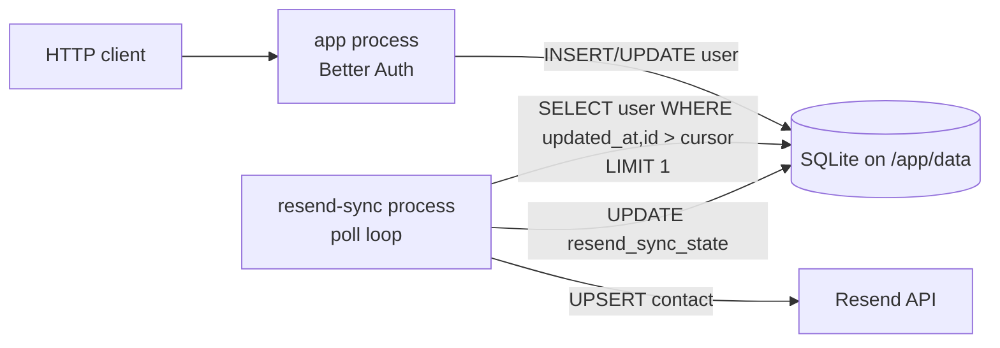

# Resend contact sync via cron-style cursor worker

## Summary

Keep Pick My Fruit's **user lifecycle** (create, profile update) in sync with **Resend Audiences** using a **small, long-running worker process** on the **same Fly machine** as the web app. The worker wakes on an interval, polls the existing `user` table for rows changed since the last successful sync, calls Resend, and advances a cursor stored in SQLite. There is **no jobs table**, **no outbox**, **no producer-side enqueue discipline** — the `user` table is itself the queue.

Email **templating** (moving magic-link and inquiry bodies into Resend Templates) is **orthogonal**; this doc covers **contact / audience sync** only.

**Related:**

- GitHub issue "Resend User Sync" (#237).
- Supersedes the outbox proposal in PR #239 (`docs/0006-resend-sync-outbox.md` on `cursor/resend-sync-outbox-plan-1755`). That design is preserved for posterity in the PR; this doc is the version we intend to implement.

---

## Goals

1. When a **user record is created** or **updated**, eventually upsert the contact in Resend and attach them to the **Global** audience.
2. **At-least-once delivery** with **safe retries** (Resend upsert is idempotent by email).
3. **Failure isolation:** a Resend outage must not block sign-up or profile saves.
4. **Minimal surface area:** no new producer code paths, no new schema beyond a single key-value row for cursor state.

---

## Non-goals

- Sub-minute propagation. The worker polls on an interval; latency = poll interval + Resend round-trip.
- A general-purpose job queue, outbox, or workflow engine.
- Running the worker on a **different machine** from the SQLite volume (Fly volumes attach to a single machine; see [Architecture](#architecture)).
- Replacing transactional email (`sendMagicLink`, inquiry mail) with this pipeline.

---

## Architecture

### One machine, two processes

| Process           | Role                                                                                                                 |
| ----------------- | -------------------------------------------------------------------------------------------------------------------- |
| **`app`**         | Serves HTTP; Better Auth writes `user` rows as usual. **No changes** to the request path.                            |
| **`resend-sync`** | Long-running process. On a timer (`RESEND_SYNC_POLL_MS`), runs a sync cycle until the queue is drained, then sleeps. |

**Why same machine, not a scheduled Fly Machine?** Fly volumes are pinned to a single machine. A scheduled Machine would either need its own volume (loses access to the live `user` table) or replicated storage (not in scope — see Non-goals). Fly's [Task scheduling blueprint](https://fly.io/docs/blueprints/task-scheduling/) covers the multi-process option (separate `[processes]` group, same image, same volume) and an in-container cron daemon; we use the former.

**Why a separate process, not an interval inside `app`?** Two small wins, no significant cost:

- Steady-state RSS for the web process stays lower; the worker can be killed/restarted independently of request serving.
- Worker crashes or hung Resend calls do not consume web-process event-loop time or sockets.

The web process never imports worker code; the worker never serves HTTP.

### Diagram



---

## Data model

### No new "jobs" table

The `user` table is the source of truth. We rely on its existing `updated_at` column (Better Auth maintains it) plus the primary key `id` to form a strictly-monotonic ordering tuple.

### `resend_sync_state` — single-row key/value table

A new **key/value** table holds the worker's cursor (and any future settings the worker needs without inviting coupling to unrelated features).

| Column       | Type         | Notes                                                         |
| ------------ | ------------ | ------------------------------------------------------------- |
| `key`        | text PK      | e.g. `cursor`                                                 |
| `value`      | text         | JSON; for `cursor`, `{ "updatedAt": <ms>, "userId": "<id>" }` |
| `updated_at` | integer (ms) | bookkeeping                                                   |

Why a KV shape rather than a fixed-column `sync_state` table:

- Tables are cheap; we'll never run out of table names. A dedicated table avoids accidentally inviting coupling between this worker and any future "settings"-like feature.
- KV inside the table gives us room to add a `last_run_at`, `last_error_at`, or `paused` flag without another migration.

Initial seed: row with `key='cursor'` and `value='{"updatedAt":0,"userId":""}'` so the first run drains all existing users.

### Index on `user`

```sql
CREATE INDEX IF NOT EXISTS user_updated_at_id_idx
  ON user (updated_at, id);
```

Required for cheap `WHERE (updated_at, id) > (?, ?) ORDER BY updated_at, id LIMIT 1` as the table grows.

### Migrations

Add via Drizzle journal; set `when` in `drizzle/meta/_journal.json` to `Date.now()` at authoring time, strictly increasing per project rules.

---

## Worker behavior

### Cycle

Each cycle of the worker:

1. Read cursor `(lastUpdatedAt, lastUserId)` from `resend_sync_state`.
2. Select the next candidate:

   ```sql
   SELECT id, email, name, phone, updated_at
   FROM user
   WHERE (updated_at, id) > (:lastUpdatedAt, :lastUserId)
   ORDER BY updated_at ASC, id ASC
   LIMIT 1;
   ```

3. If no row: cycle is **drained**; return and sleep until next tick.
4. Otherwise: upsert into Resend (idempotent by email; attach to Global audience).
5. On success: `UPDATE resend_sync_state` setting `value = {"updatedAt": row.updated_at, "userId": row.id}`. **Loop** back to step 1 — keep cycling `LIMIT 1` until exhausted, then exit the cycle and sleep.

### Why `LIMIT 1` in a tight loop instead of `LIMIT N`

- Each iteration commits its own cursor advance, so a crash mid-drain costs at most one redundant retry of the last row on next start.
- Backlog drainage is still O(N) round-trips, which is the Resend API cost ceiling anyway.
- Simpler reasoning about partial-failure: there is no "batch half succeeded" state.

### Cursor ordering tuple

Always order by `(updated_at ASC, id ASC)` and persist both. `updated_at` collisions are common during seeding, backfills, or any bulk operation; the `id` tiebreaker makes the cursor monotonic without ambiguity.

### Failure semantics

| Failure                                                      | Action                                                                                                                                                           |
| ------------------------------------------------------------ | ---------------------------------------------------------------------------------------------------------------------------------------------------------------- |
| Resend **4xx** (e.g. invalid email format, validation error) | **Advance** the cursor past the row; record to **Sentry** with `userId` and Resend status. Treat as "this row will never succeed without a code or data change." |
| Resend **5xx** or network/timeout                            | **Stall**: do **not** advance the cursor. Record to **Sentry** (rate-limited / fingerprinted separately from the 4xx case). Next tick will retry the same row.   |
| Worker process crash                                         | Same as stall: the unadvanced cursor causes the row to be retried after restart.                                                                                 |

We deliberately do **not** introduce a dead-letter table or `attempt_count` column yet. If 4xx triage in Sentry shows recurring permanent failures (more than a handful per week), revisit with a dead-letter list (see [Future work](#future-work)).

### Updates that don't materially change Resend state

Better Auth bumps `user.updated_at` for changes that Resend does not care about (and may bump it for session/timestamp updates we add later). The worker will issue redundant idempotent upserts in those cases. This is acceptable: Resend upserts are cheap and idempotent.

**Critical exception — newsletter opt-out:** if/when the `user` schema gains a "subscribed to newsletter" flag, the worker **must not** re-subscribe a user who has opted out. The Resend call must reflect the current opt-in state (e.g. `unsubscribed: !user.subscribed`), not blindly upsert with `unsubscribed: false`. Mark this with a code comment at the Resend-mapping function and cover it with a unit test ("opted-out user is upserted with `unsubscribed: true`"). See [Future work](#future-work) for the larger subscription-management story.

### Polling interval

`RESEND_SYNC_POLL_MS`, default `60_000` (1 minute) in prod, `1_000` in dev/test. The cycle exits early when drained, so the steady-state cost is one indexed `SELECT` per minute against a small table.

### Signals

- **`SIGTERM` / `SIGINT`:** finish the **current row** (so we never have "Resend succeeded, cursor not yet committed"), then exit 0. Use an `AbortController` shared with the sleep between cycles so a signal during sleep wakes immediately.
- No need for a `SIGUSR2`-style wake signal at this stage; the poll interval is short enough.

---

## SQLite PRAGMAs

Two processes opening the same file. Same recommendations as the outbox design:

- `journal_mode=WAL`
- `synchronous=NORMAL`
- `busy_timeout=5000` on **both** connections

Centralize PRAGMA setup so the worker and the web server agree.

---

## Deployment

- **`fly.toml`:** second `[processes]` group `resend_sync` with its own command (e.g. `node apps/www/dist/resend-sync.js`); same image, same `[[mounts]]`, no `[[services]]`.
- **Secrets:** `RESEND_API_KEY`, audience ID, available to the `resend_sync` process.
- **Env:** `RESEND_SYNC_POLL_MS`, `DATABASE_URL` (or file path) identical to the web process.
- **Local dev:** `pnpm` script to run the worker alongside `pnpm dev`, sharing the same `.db` file. Optional and not on the critical path for shipping.

---

## Observability

- `logger.info({ userId, updatedAt }, "resend-sync: upserted")` on success.
- `Sentry.captureException` on Resend failure, fingerprinted to separate 4xx (per-user, advances) from 5xx/network (stalls).
- Optionally: a single Pino "cycle drained, N rows processed" log line per non-empty cycle. Skip log lines on empty cycles to avoid log spam every minute.

OpenTelemetry traces are **not** in scope for v1. If we add them later, wrap one span per cycle and one child span per row + Resend call.

---

## Testing strategy

### Unit

- Cursor advance: given a fixture `user` table and a starting cursor, one cycle invokes the Resend client once with the expected payload and writes the new cursor.
- Tuple ordering: rows with identical `updated_at` are processed in `id` order; the cursor lands on the last one.
- 4xx handling: cursor advances past a row whose Resend call returned 4xx; Sentry captured.
- 5xx handling: cursor does **not** advance; Sentry captured.
- **Opt-out guard:** a user with `subscribed = false` (once that field exists) is upserted with `unsubscribed: true`.

### Integration

- Drive a Better Auth user create through its HTTP API against a test SQLite file → run one worker cycle → Resend stub received the upsert.
- Drive a user update → run one cycle → stub received the update.

### E2E

Not required for this slice.

### TDD discipline

Red-green double-loop is preferred but not mandated. The implementation surface is small enough that one or two integration tests plus the unit list above cover the risk.

---

## Sequence (commits)

| #   | Commit focus                                                                                | Testable output                                                                                    |
| --- | ------------------------------------------------------------------------------------------- | -------------------------------------------------------------------------------------------------- |
| 1   | `resend_sync_state` table + `user(updated_at, id)` index + migration                        | Migration applies cleanly; introspection shows table and index.                                    |
| 2   | Cursor read/write helper + Zod schema for the `cursor` value                                | Unit tests: round-trip, default seed, malformed value rejected.                                    |
| 3   | `processOneRow` — selects next row by tuple, calls injected Resend client, advances cursor  | Unit tests cover the success, 4xx, and 5xx paths against a `:memory:` SQLite.                      |
| 4   | `runCycle` — loops `processOneRow` until drained                                            | Unit test: seed N users → one `runCycle` → Resend stub called N times → cursor is on the last row. |
| 5   | Resend client mapping (real HTTP call behind an interface, incl. opt-out guard)             | Contract test with `fetch` mock asserting URL/method/body.                                         |
| 6   | Worker entrypoint: env parsing, DB open with shared PRAGMAs, sleep loop, `SIGTERM` handling | Subprocess test: starts, drains, sleeps, exits 0 on `SIGTERM`.                                     |
| 7   | Fly multi-process wiring + secrets                                                          | `fly deploy` preview or CI Docker run smoke.                                                       |

---

## Risks and mitigations

| Risk                                                             | Mitigation                                                                   |
| ---------------------------------------------------------------- | ---------------------------------------------------------------------------- |
| `updated_at` ties cause a row to be skipped                      | Compound `(updated_at, id)` tuple in both the query and the cursor.          |
| Worker stalls indefinitely on a poisoned row                     | Stall is **only** on 5xx/network; 4xx advances. Sentry surfaces both.        |
| SQLite `SQLITE_BUSY` between web writes and worker writes        | WAL + `busy_timeout=5000`; worker writes are tiny single-row cursor updates. |
| `user.updated_at` is bumped for fields Resend doesn't care about | Accepted cost: idempotent upserts. Comment at the mapping function explains. |
| Newsletter opt-out gets clobbered on re-sync                     | Mapping function reads the opt-out flag; unit test guards it.                |
| Worker killed between Resend success and cursor update           | Idempotent Resend upsert means the retry is harmless.                        |

---

## Future work

### A. Nightly/weekly full-sync reconciliation (self-healing)

Run a scheduled full diff between `user` and Resend's audience. For each user, ensure the contact exists with the correct fields and subscription state; for any Resend contact not in `user`, decide policy (delete? leave?). This is a **belt** alongside the cursor worker's **suspenders**:

- Recovers from any past bug, dropped event, or manual data fix without operator intervention.
- Catches drift caused by edits made directly in the Resend dashboard.
- Cost is one bulk pass per week (or per night) — well within Resend rate limits at our scale.

Implement as a separate entry point in the same `resend-sync` process (e.g. invoked daily via in-process timer or as a separately-scheduled command). Skip until we have evidence of drift in production.

### B. Two-way subscription sync

Today, opt-out lives only in Resend. To respect opt-out at signup, in profile pages, and across the app:

- Add a `subscribed` (or `newsletter_status`) column on `user`.
- Expose subscription state in profile UI.
- On Resend webhook (`contact.unsubscribed`), update the local row.
- The cursor worker continues to be the **outbound** half; the webhook is the **inbound** half.

### C. Dead-letter list

If Sentry shows recurring 4xx failures for specific users (e.g. malformed emails imported during a migration), add a `resend_sync_dead_letter` table (or a `dead_letter: [userId, ...]` value in `resend_sync_state`) so operators can re-attempt after fixing the data without rewinding the cursor for the whole table.

### D. Extract the worker

Move `resend-sync` to `apps/resend-sync` with a shared `packages/resend-sync-contract` for the Resend payload mapping. Same Fly app, same volume — just code organization. Defer until a second integration (e.g. a different audience or analytics provider) justifies the package boundary.

### E. General-purpose job queue / durable workflows

Tracked: [#123](https://github.com/jamesarosen/PickMyFruit/issues/123), [#126](https://github.com/jamesarosen/PickMyFruit/issues/126). Out of scope until we have multiple async integrations or stricter latency requirements.

---

## References

- Better Auth — [Database hooks](https://better-auth.com/docs/concepts/database#database-hooks) (not used by this design, but relevant if Future Work B adds inbound webhooks)
- Fly.io — [Task scheduling blueprint](https://fly.io/docs/blueprints/task-scheduling/)
- Fly.io — [Run multiple processes](https://fly.io/docs/app-guides/multiple-processes/)
- Project conventions — `AGENTS.md`, `CLAUDE.md` (migrations, logging, Sentry)
- Superseded predecessor — `docs/0006-resend-sync-outbox.md` on PR #239
