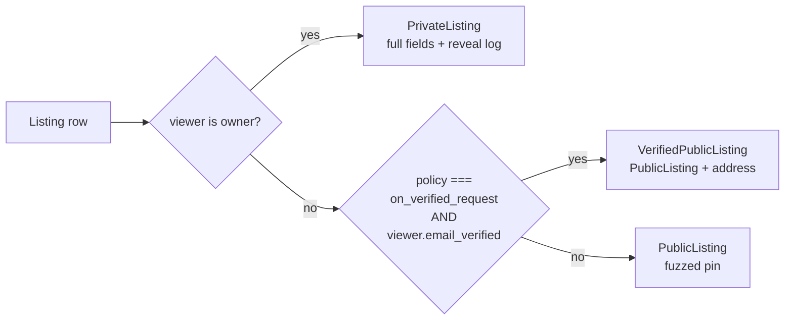

# 0009: Address Release Policy

## Summary

Every listing has an **`address_release_policy`** that decides _how_ its
precise street address reaches non-owners. Two values exist today:

| Policy                | Who sees the precise address                       | Path                                                                                                |
| --------------------- | -------------------------------------------------- | --------------------------------------------------------------------------------------------------- |
| `on_owner_approval`   | requester, after the owner approves                | The existing inquiry flow (`submitInquiryWorkflow`)                                                 |
| `on_verified_request` | any signed-in member with a verified email address | A new synchronous reveal server function (`revealListingAddress`) that appends to `address_reveals` |

`on_owner_approval` is the default and matches the behavior of every
listing that existed before this migration. `on_verified_request` is the
substrate for the upcoming Community Produce Stand listing type — this
issue ships the _mechanism_ and the UI control; the stand-specific
guardrails (steward requirement, drop-off framing, raw-whole-produce
restriction) land in a follow-up.

## Authorization vs. record-keeping

Authorization for `on_verified_request` is a property of the **viewer**
(`user.email_verified`), not a `(user, listing)` pair. There is **no
access-control join table**. Reveals are nevertheless recorded in an
append-only event log (`address_reveals`) for:

- attribution and unique-member analytics,
- detecting repeat engagement (no dedupe — every reveal is a row),
- seeding future gleaner follow-ups (a deferred kokoto workflow).

Authz answers "may you see it." The log records "you did."

A verified viewer's access **persists** across visits because it's just
their verification state — there is no per-visit re-request.

## Schema (migration `0009`)

```sql
ALTER TABLE listings ADD COLUMN address_release_policy TEXT NOT NULL
  DEFAULT 'on_owner_approval'
  CHECK (address_release_policy IN ('on_owner_approval','on_verified_request'));

CREATE TABLE address_reveals (
  id         INTEGER PRIMARY KEY AUTOINCREMENT,
  user_id    TEXT NOT NULL REFERENCES user(id)     ON DELETE CASCADE,
  listing_id INTEGER NOT NULL REFERENCES listings(id) ON DELETE CASCADE,
  created_at INTEGER NOT NULL
);
CREATE INDEX address_reveals_listing_idx ON address_reveals (listing_id, created_at);
CREATE INDEX address_reveals_user_idx    ON address_reveals (user_id, created_at);
```

The `listing_id` is `INTEGER` to match `listings.id`. The default on
`address_release_policy` preserves the existing behavior for every
already-created listing.

## Shape projection — not a stored class

There is still only one `Listing` row per listing; a presenter picks the
shape based on `(policy × viewer tier)`:



```ts
type PublicListing = {
	/* fuzzed pin, no street address */
};
type VerifiedPublicListing = PublicListing & { address; city; state; zip };
type PrivateListing = OwnerListingView; // full listing + photos
```

`listingShapeFor(listing, viewer, photos)` lives in
`src/data/listing.ts` and returns the right one. The page loader
(`getListingForViewer`) keeps its existing behavior — it returns a
`PublicListing` for `on_verified_request` listings to non-owners, and
the reveal happens through a separate server function so the address
release is an _explicit_ action that writes a row.

## Reveal flow (`on_verified_request`)

`revealListingAddress(listingId)` is a synchronous server function with
POST semantics (it writes a row). A single insert does not warrant
durability — no kokoto workflow.

1. Look up the listing (404 if missing).
2. If the policy is not `on_verified_request` for a non-owner: reject as
   `NOT_ALLOWED` (the caller is on the wrong path).
3. If the viewer is unauthenticated → `{ tag: 'gated', reason:
'unauthenticated' }` (no row written).
4. If the viewer is authenticated but `!emailVerified` and not the
   owner → `{ tag: 'gated', reason: 'email_unverified' }` (no row
   written).
5. Otherwise, append an `address_reveals` row (skip the write for
   owners), and return `{ tag: 'revealed', listing: VerifiedPublicListing
}`.

If the row write fails after the eligibility check passes, the response
**still releases the address** (the member is unblocked) but emits a
`captureMessage` + `captureException` with the fingerprint
`['address-release', 'reveal', 'event-write-failed']` so the silent
audit-trail loss is surfaced.

## Observability — the money moment

`listing.address.revealed` is the closest observable proxy for "a member
now has the address." The funnel is:

```
view → reveal.click → revealed
                   ↘ reveal.gated   (conversion leak from email verification friction)
```

### Metrics

| Counter                        | Attributes | Meaning                                               |
| ------------------------------ | ---------- | ----------------------------------------------------- |
| `listing.address.reveal.click` | `policy`   | member asked to see the address                       |
| `listing.address.reveal.gated` | —          | viewer hit the verify-email wall (funnel leak)        |
| `listing.address.revealed`     | `policy`   | address shown to a verified member (**money moment**) |

### Breadcrumbs (per reveal request)

`reveal.requested {listingId, policy}` → `auth.checked {verified}` →
either `reveal.event.written {rowId}` or `reveal.gated`. The crumbs make
a silent failure reconstructable from a single Sentry event.

### `captureMessage` — silent-failure detection

- The reveal row write failed but the address was still shown (signal
  lost, no error surfaces).
- A reveal was requested on a listing with a missing or un-geocoded
  address.

### Fingerprints

`['address-release','reveal', <reason>]` so one bad listing cannot mask
broader reveal-path errors.

### Pino (server-side, per reveal)

`{ listingId, userId, policy, verified, wroteEvent }`.

## UI surface

- The new-listing form (`/listings/new`) carries a release-policy radio
  with honest help text — no false privacy promise on the
  `on_verified_request` option. The text explicitly warns that the
  location is "effectively public" because verified members can reshare
  it.
- The public listing page (`/listings/$id`) shows an "Address" row for
  `on_verified_request` listings with a "Show street address" button.
  Anonymous and unverified-email viewers see a gated message instead of
  the address.

## Follow-up

The Community Produce Stand built on this mechanism ships in
[0010](./0010-community-produce-stands.md): the `produce-stand` produce type,
two-way drop-offs, and the gated steward identity. The address-release policy
is **orthogonal** to the stand type — a stand may use either policy.

## Future work (held in the Community Produce Stand plan)

- `community-produce-stand` listing kind + preset
  (`on_verified_request` + drop-offs + steward).
- `accepts_drop_offs` column on `listings`.
- Raw-whole-produce restriction + ToS clause; steward-required
  validation.
- Same-map "instant vs. owner responds" expectation cue.
- `last_stocked_at` liquidity signal — seeded by a confirmed-drop-off
  signal, not a reveal click.
- Drop-off suggestion N days after a non-stand listing is created.
