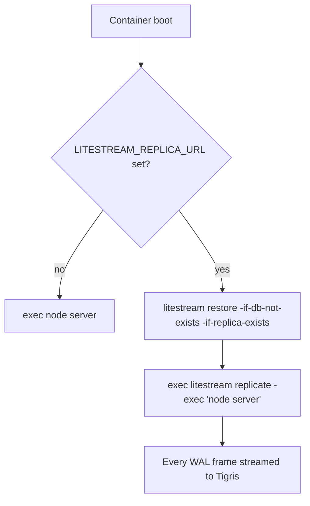

# 0010: Database Durability

## Summary

The entire product lives in one SQLite file on one Fly volume. Before this
change, the only protection was Fly's automatic **daily** volume snapshots
(retained ~5 days), giving a worst-case data loss window of 24 hours — for a
site whose value _is_ its data (listings, users, inquiries, reveal history),
that is the project's largest single risk.

This ADR adds **continuous off-volume replication with
[Litestream](https://litestream.io)**, restore-on-boot for empty volumes, and
a tested restore runbook. Recovery point objective drops from ~24 hours to
~1 second.

| Layer                        | RPO                              | Covers                                            |
| ---------------------------- | -------------------------------- | ------------------------------------------------- |
| Litestream replication       | ~1s                              | volume loss, machine loss, region incident        |
| Litestream point-in-time     | ≤ retention window (default 24h) | bad migration, bad `db:push`, app-level data bugs |
| Fly volume snapshots (daily) | ~24h                             | belt-and-suspenders fallback for everything above |

## How it works

`apps/www/docker-entrypoint.sh` wraps the server process. Both `fly.toml` and
`fly.preview.toml` boot through it.



- **Unset** (preview apps, docker-compose, local): the server starts directly.
  The feature is entirely opt-in via environment.
- **Set** (production): a fresh volume is restored from the newest replica
  generation before the server starts; `-if-db-not-exists` makes this a no-op
  on every normal boot, and `-if-replica-exists` lets the very first deploy
  boot before any replica exists. Litestream then runs as PID 1, forwards
  signals to the Node child, and exits when it exits.
- `RUN_MIGRATIONS_ON_BOOT` is unaffected: migrations run inside the Node
  process, after any restore, with replication already streaming.
- The kokoto workflow tables live in the same database file, so durable jobs
  are covered by the same replica.

Relatedly, `db.server.ts` sets `PRAGMA synchronous = NORMAL` — the
recommended pairing with WAL. Commits fsync at checkpoint rather than
per-commit; an OS crash can drop the final few commits but cannot corrupt the
file, and replication keeps the practical loss window at ~1 second.

## Configuration

Replication is configured entirely through environment (Fly secrets — none of
these belong in `fly.toml [env]`):

| Variable                                                    | Example                                                  | Notes                                                          |
| ----------------------------------------------------------- | -------------------------------------------------------- | -------------------------------------------------------------- |
| `LITESTREAM_REPLICA_URL`                                    | `s3://pickmyfruit-db-backup.fly.storage.tigris.dev/prod` | Bucket + path. Unset ⇒ replication disabled.                   |
| `LITESTREAM_ACCESS_KEY_ID` / `LITESTREAM_SECRET_ACCESS_KEY` | _(from `fly storage create`)_                            | Litestream also falls back to `AWS_ACCESS_KEY_ID`/`_SECRET_…`. |

Use a **dedicated bucket**, not the media bucket: backups want different
credentials (write-mostly, never public) and a different lifecycle than
public photos. Scoped `LITESTREAM_*` credentials keep the media keys out of
the backup path entirely.

### One-time setup

```sh
fly storage create --name pickmyfruit-db-backup   # note the emitted keys
fly secrets set \
	LITESTREAM_REPLICA_URL='s3://pickmyfruit-db-backup.fly.storage.tigris.dev/prod' \
	LITESTREAM_ACCESS_KEY_ID='…' \
	LITESTREAM_SECRET_ACCESS_KEY='…'
fly deploy
```

Verify after deploy:

```sh
fly logs | grep litestream          # expect "starting server under replication"
fly ssh console -C \
	"litestream snapshots -replica-url \$LITESTREAM_REPLICA_URL"
```

## Restore runbook

Restores happen in three scenarios. **Practice scenario C quarterly** — a
backup that has never been restored is a hope, not a backup.

### A. Machine/volume replaced (automatic)

Nothing to do. A new machine with an empty volume restores the latest replica
generation at boot before the server starts. Verify with
`curl https://www.pickmyfruit.com/api/health` and a spot-check of recent
listings.

### B. Point-in-time recovery (bad migration, bad data)

Use when the database is _present but wrong_ — the boot-time restore will not
overwrite an existing file by design.

```sh
fly ssh console
# inside the machine — stop writes by scaling down first if the situation allows:
litestream restore -timestamp 2026-06-12T00:00:00Z \
	-o /app/data/restored.db "$LITESTREAM_REPLICA_URL"
sqlite3 /app/data/restored.db 'PRAGMA integrity_check; SELECT COUNT(*) FROM listings;'
# swap files (db + -wal/-shm), then restart the machine:
mv /app/data/db.sqlite /app/data/db.sqlite.bad && rm -f /app/data/db.sqlite-wal /app/data/db.sqlite-shm
mv /app/data/restored.db /app/data/db.sqlite
exit
fly machine restart <machine-id>
```

Timestamps beyond the retention window (default 24h of WAL history; the
latest snapshot is always kept) fall back to the nearest available snapshot.

### C. Local restore (drills, forensics)

```sh
AWS_ACCESS_KEY_ID=… AWS_SECRET_ACCESS_KEY=… \
	litestream restore -o /tmp/pickmyfruit.db \
	's3://pickmyfruit-db-backup.fly.storage.tigris.dev/prod'
sqlite3 /tmp/pickmyfruit.db 'PRAGMA integrity_check; SELECT COUNT(*) FROM listings;'
```

## Alternatives considered

- **Fly volume snapshots alone** (status quo): 24h RPO, restore requires
  volume surgery, and snapshot retention is short. Kept as fallback only.
- **Move to LiteFS / libsql server / hosted Postgres**: solves replication
  but changes the operational model and the data layer; out of proportion to
  current scale. Litestream is invisible to the application.
- **Cron `sqlite3 .backup` to the media bucket**: simpler, but hours-scale
  RPO and a second code path to maintain; Litestream's WAL shipping is
  strictly better for the same operational cost.

## Limitations

- Replication is asynchronous — a hard crash can lose the final ~1s of
  writes. Acceptable at current scale.
- Uploaded photos are already in Tigris and are not part of this replica;
  local-storage deployments (`STORAGE_PROVIDER=local`) have no photo backup.
- Single replica destination. Adding a second (e.g. another region/provider)
  requires switching from the URL form to a Litestream config file.
