# 0014 — Home listings grid follows the map viewport

## Problem

The home page loaded the 12 listings nearest Napa once, in the route loader.
Panning or zooming the map only re-clustered those same 12 listings — the grid
never changed and the map could never surface listings outside the initial
fetch. We want the grid to reflect what the user is looking at.

Three constraints shaped the design:

1. **Sparse data** — ~12 listings exist, so most viewports are empty; the empty
   state is the common case and must never dead-end.
2. **Rectangle vs. hexagons** — the viewport is a rectangle; our search and
   privacy model are H3 hexagons.
3. **Grower acquisition** — the grid is primarily for pickers, but it's a place
   to recruit growers without diluting trust.

## Privacy invariant

Listings store exact coordinates (`lat`/`lng`, `h3_index` at resolution 13) but
the public shape exposes only `approximateH3Index` at **resolution 8**
(~0.74 km²). The rule across every unauthenticated path:

> Membership and ordering depend only on resolution-≤8 cells, never on exact
> coordinates.

Two oracles are closed:

- **Bounding-box oracle** — a raw `lat/lng BETWEEN` filter lets a picker slide a
  thin rectangle and binary-search the true point. We filter on the stored
  resolution-8 cell only (`public_h3_index IN (…)`); there is no raw-coordinate
  bbox and no degree/metre padding.
- **Nearest-neighbour ordering oracle** — ordering by _exact_ distance leaks
  sub-resolution-8 position through observable array order. `getNearestListings`
  quantizes both the query centre and each listing to their resolution-8 cell
  centres before comparing, so order resolves only to resolution-8 granularity.

```mermaid
flowchart LR
  V[Map viewport rectangle] -->|viewportToCells| C[res-8 H3 cover set]
  C -->|public_h3_index IN cells| Q[(listings)]
  Q -->|toPublicListing| G[PublicListing&#91;&#93; ordered by id]
```

## Data flow

- **Storage** — a new indexed `listings.public_h3_index` (resolution 8) column,
  derived on write in `createListing` and read by the viewport query. Legacy
  rows are backfilled by `pnpm db:backfill-public-h3` (H3 cannot be computed in
  SQLite); `toPublicListing` derives it on the fly for non-viewport reads.
- **`lib/h3-viewport.ts`** — `viewportToCells(bounds)` validates the rectangle
  (ordered, within Mercator latitude, no antimeridian crossing) and returns the
  resolution-8 cover, or `too-broad` for viewports larger than a metro area.
- **`getListingsInViewport`** (POST, rate-limited) — returns the listings whose
  `public_h3_index` is in the cover, ordered by `id`, capped at 60 as a DoS
  guard. POST keeps the bounds out of URLs, access logs, and referrers.
- **`getNearestListings`** (GET) — privacy-safe proximity ordering; powers the
  loader's default framing and the empty-viewport fallback.

## Client behaviour

- The map (`ListingsMap`) emits the settled viewport on `moveend` (debounced)
  and once on initial framing; `getBounds()` is reliable as soon as the camera
  is set, so this works even when tiles fail to load.
- The home route loads `getNearestListings` (URL `?lat&lng&z` or Napa) for a
  deterministic, shareable SSR first paint, then refines client-side as the user
  moves. Updating the listing source never moves the camera, so there is no
  fetch→recenter loop. A monotonic request id discards stale responses.
- **Empty viewport** shows a picker-first "be the first" block with a
  Jump-to-nearest action, a divider, and a "Nearest listings" section whose
  cards are dimmed and carry a distance chip. The live region announces the mode
  so assistive tech distinguishes in-view results from the nearest fallback.
- **Grower CTA** appears as a trailing dashed card in populated grids and as the
  secondary action in the empty state.

Clicking a cluster zooms into its cell (which re-queries the viewport). The old
`?area` click-to-filter mechanism is removed.

## Testing

- Unit: `h3-viewport` (res-8 floor, too-broad, sub-cell stability), `rate-limit`,
  `getNearestListings` (ordering stable under sub-res-8 centre moves; no raw
  coordinates returned).
- E2E (`home-viewport.test.ts`): pan/centre swaps the grid; empty viewport shows
  the nearest fallback and Jump-to-nearest; grower CTA links to `/listings/new`;
  a `?lat&lng&z` deep link server-renders the matching grid.
