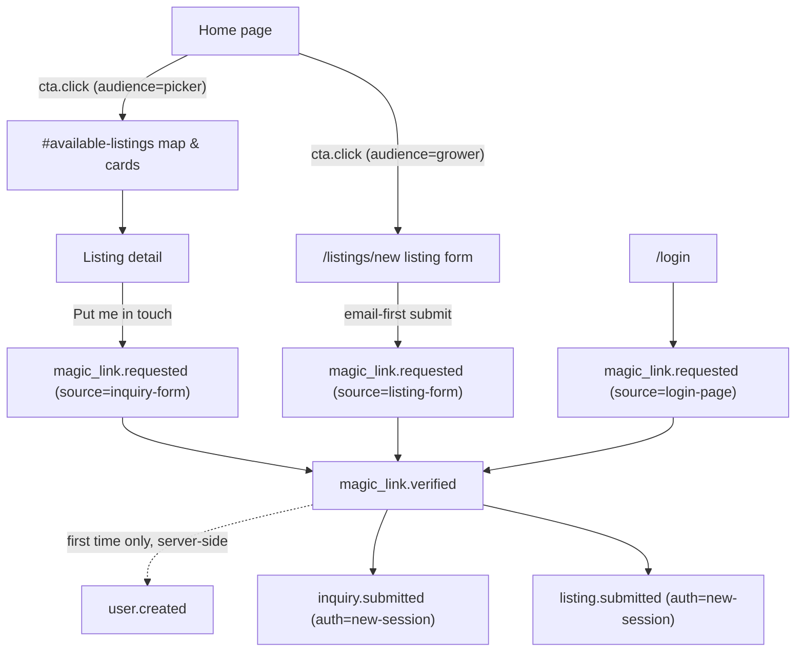

# Onboarding Telemetry

How we measure the journey from "first visit" to "participating member," for
growers, pickers, and grower-pickers. All events flow through Sentry — there is
no separate analytics system. The single source of truth for event names is
`apps/www/src/lib/onboarding-telemetry.ts`; keep this document in sync with it.

## How events are emitted

Every event emits **two** Sentry signals:

- A **metric** (`Sentry.metrics.count(name, 1, { attributes })`) — for funnel
  counts and dashboards. Query these in Sentry under **Metrics** by the names
  below.
- A **breadcrumb** (`category: 'onboarding'`, `message: <event name>`) — so any
  error or message captured mid-journey carries the visitor's step-by-step
  trail. Filter breadcrumbs by category `onboarding` when triaging.

One event additionally raises a warning-level `Sentry.captureMessage`
(`onboarding.magic_link.verify_failed`) because a visitor who tried to join and
could not get in is worth alerting on, not just counting.

## Event vocabulary

| Event                                 | Attributes                                                                                   | Emitted from                                                                                                                        | Meaning                                                                                                                                                           |
| ------------------------------------- | -------------------------------------------------------------------------------------------- | ----------------------------------------------------------------------------------------------------------------------------------- | ----------------------------------------------------------------------------------------------------------------------------------------------------------------- |
| `onboarding.cta.click`                | `audience`: `grower` \| `picker`; `placement`: `hero` \| `how-it-works`                      | `routes/index.tsx`                                                                                                                  | A home-page call to action was clicked. The `audience` attribute is our best signal for which segment a visitor self-identifies with.                             |
| `onboarding.magic_link.requested`     | `source`: `login-page` \| `inquiry-form` \| `listing-form`; `trigger`: `initial` \| `resend` | `routes/login.tsx`, `components/InquiryForm.tsx`, `components/ListingForm.tsx`, `components/MagicLinkWaiting.tsx` (resend)          | A magic-link email was successfully requested.                                                                                                                    |
| `onboarding.magic_link.verified`      | `source` as above; `method`: `manual-token` \| `email-link`                                  | `components/MagicLinkWaiting.tsx` (manual token), `components/InquiryForm.tsx` and `components/ListingForm.tsx` (email-link return) | The visitor completed authentication.                                                                                                                             |
| `onboarding.magic_link.verify_failed` | `source`                                                                                     | `components/MagicLinkWaiting.tsx`                                                                                                   | Token verification failed. Also raises a **warning** `captureMessage` with the same name.                                                                         |
| `onboarding.inquiry.submitted`        | `auth`: `new-session` \| `existing-session`                                                  | `components/InquiryForm.tsx`                                                                                                        | An inquiry reached a listing owner — the end of the picker funnel. `new-session` means the visitor authenticated during this flow (a true onboarding completion). |
| `onboarding.listing.submitted`        | `auth` as above                                                                              | `components/ListingForm.tsx`                                                                                                        | A listing was created — the end of the grower funnel.                                                                                                             |
| `onboarding.user.created`             | —                                                                                            | `lib/auth.server.ts` (Better Auth `user.create.after` hook, server-side)                                                            | A brand-new account exists. This is the only event that cleanly separates signups from returning sign-ins.                                                        |

## The funnels

Notes for anyone reading the numbers:

- Listing lifecycle events beyond creation are outside this vocabulary (see
  `src/api/listings.ts` for address-reveal metrics, which follow the same
  metric+breadcrumb pattern).
- A visitor who signs in via the **emailed link from the login page** never
  runs client code we can observe at the moment of verification — they land
  directly on `returnTo`. Their verification is only visible as
  `user.created` (first time) or a Better Auth session (returning). The
  `method=email-link` attribute is only observable on the inquiry flow, which
  resumes client-side.
- `cta.click` under-counts pickers who scroll straight to the map without
  using a CTA. Treat it as a signal of copy resonance, not total picker
  traffic.

## Extending the vocabulary

1. Add a `track*` function to `apps/www/src/lib/onboarding-telemetry.ts` with
   a one-test-per-behavior entry in
   `apps/www/tests/onboarding-telemetry.test.ts`.
2. Keep the `onboarding.` prefix and dot-separated segments; put variation in
   attributes, not in new event names, so Sentry metric cardinality stays low.
3. Update the table and diagram above.
